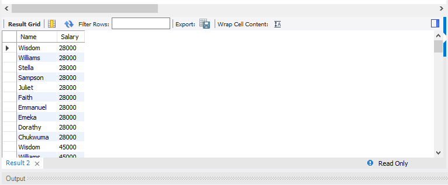
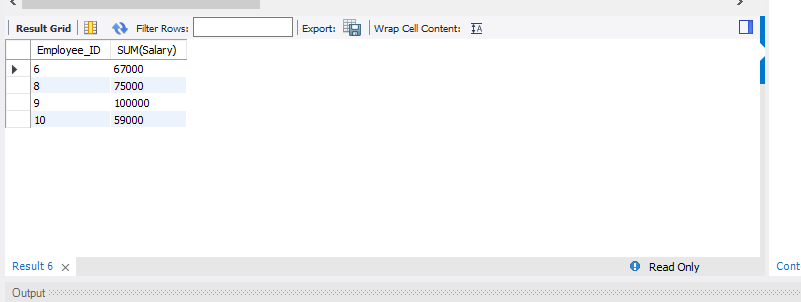
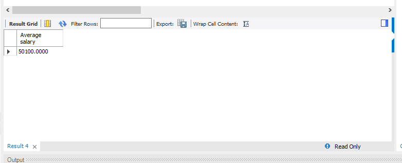
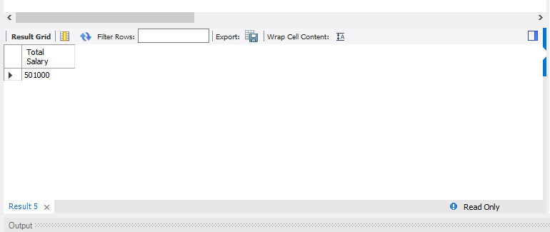
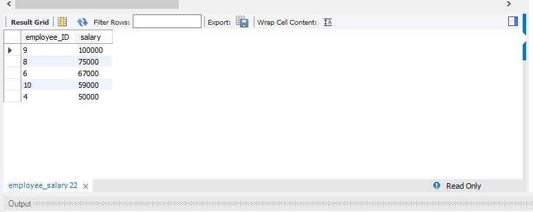

# Joins and aggregate functions

## Introduction:

SQL offers a powerful way to generate business questions and effectively uncover valuable insights from a large data set.

In this task, four business questions were formulated and employed SQL commands such as ORDER BY, GROUP BY, and AGGREGATE FUNCTIONS to obtain valuable insights from the superstore table.

These commands serve as tools for summarizing and structuring data, enabling easy identification of trends within the business data.

## Problem Statement:
Come up with 4 business questions and query the tables provided. Ensure you use the following commands;

- JOINS
- GROUP BY
- At least 2 AGGREGATE functions
- ORDER BY

## Generated Questions:

1. Join two tables (Employee_info tabel and Employee_salary table) to get the name and salary at one display
2. Get employee ID with salary greater than 50000
3. Calculate the average salary from the Employee_salary table
4. Sum the total salary of all the employee from the employee_salary table
5. Calculate the top 5 salary earners from the employee_salary table

Join two tables (Employee_info tabel and Employee_salary table) to get the name and salary at one display:

The above snapshot shows the Employee name and Employee salary at one display. Which was generated by joining two tables (Employee_info tabel and Employee_salary table). The syntax used to achieve this result is as follows;

_Use staff;_

_Select Name, Salary from employee_info_

_join employee_salary;

Employee ID with salary greater than 50000:

The above snapshot shows the employee_ID with salary greater than 50000. And the syntax used to achieve this result is as follows;

_SELECT Employee_ID, SUM(Salary) FROM employee_salary_

_GROUP BY employee_ID_

_HAVING SUM(Salary) > 50000;_

The average salary from the Employee_salary table:

The above snapshot shows the average salary from the Employee_Salary table. And the syntax use is as follows;

_Select * from Employee_salary;_

_Select Avg(Salary) As `Average salary` from employee_salary;_

Total salary of all the employee from the employee_salary table:

The above snapshot shows the total salary of the employee from the employee_salary table. The command used to get this result is as follows;

_Select Sum(Salary) As `Total Salary` from employee_salary;_

Top 5 salary earners from the employee_salary table;

The above snapshot shows the the top 5 salary earners from the eomployee_salary table. The syntax used to achieve this result is as follows;

_SELECT employee_ID, salary FROM employee_salary_

_WHERE salary > 40000_

_ORDER BY salary DESC_

_limit 5;_

